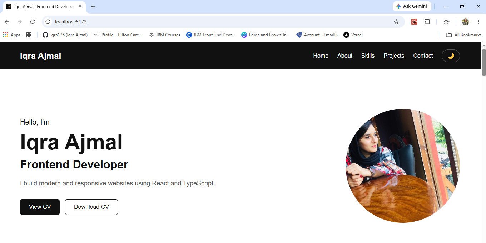
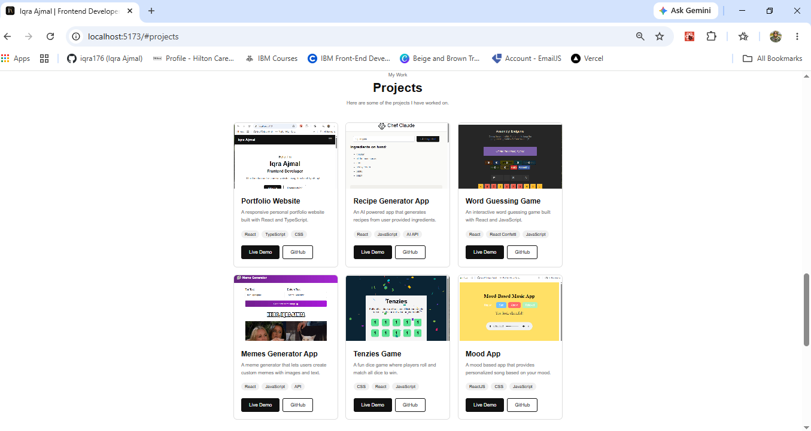
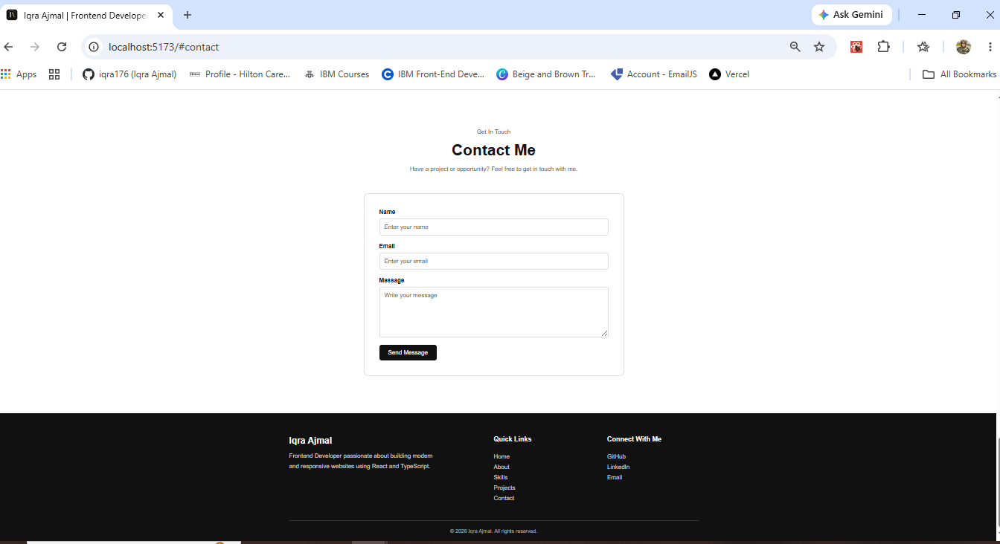

# 👩‍💻 Iqra Ajmal — Front-End Developer Portfolio

A responsive personal portfolio website built with **React, TypeScript, and Vite** to showcase my projects, skills, experience, and web development journey.

## ✨ Features

* Responsive portfolio design
* About Me section
* Technical skills showcase
* Projects section
* Experience section
* Contact section
* Download CV functionality
* Responsive navigation
* Modern and clean UI

## 🛠️ Technologies Used

* React.js
* TypeScript
* Vite
* HTML5
* CSS3
* JavaScript
* Git & GitHub

## 📂 Featured Projects

* **Recipe Generator** — AI-powered recipe generation application
* **Mood-Based App** — React application providing personalized content based on mood
* **Weather App** — Weather information application
* **Todo App** — Task management application

## 🚀 Getting Started

### Prerequisites

Make sure you have **Node.js** installed.

### Installation

Clone the repository:

```bash
git clone https://github.com/iqra176/My-Portfolio.git
```

Go to the project directory:

```bash
cd My-Portfolio
```

Install dependencies:

```bash
npm install
```

Start the development server:

```bash
npm run dev
```

Open the local URL shown in your terminal.

## 📸 Screenshots

### 🏠 Home



### 💼 Projects



### 📩 Contact



## 🌐 Live Demo

[View Live Portfolio](https://my-portfolio-f6qen7vxl-iqra-ajmal.vercel.app/)

## 👩‍💻 Author

**Iqra Ajmal**

GitHub: https://github.com/iqra176
